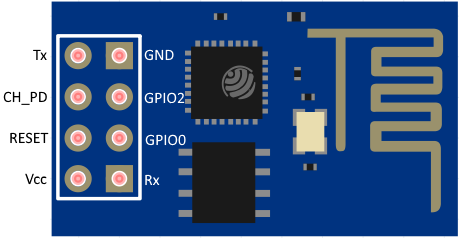
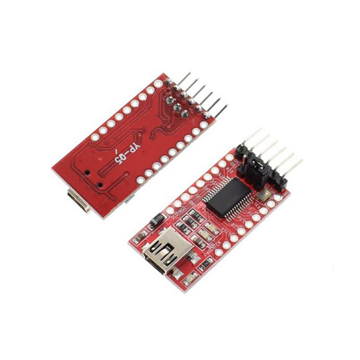
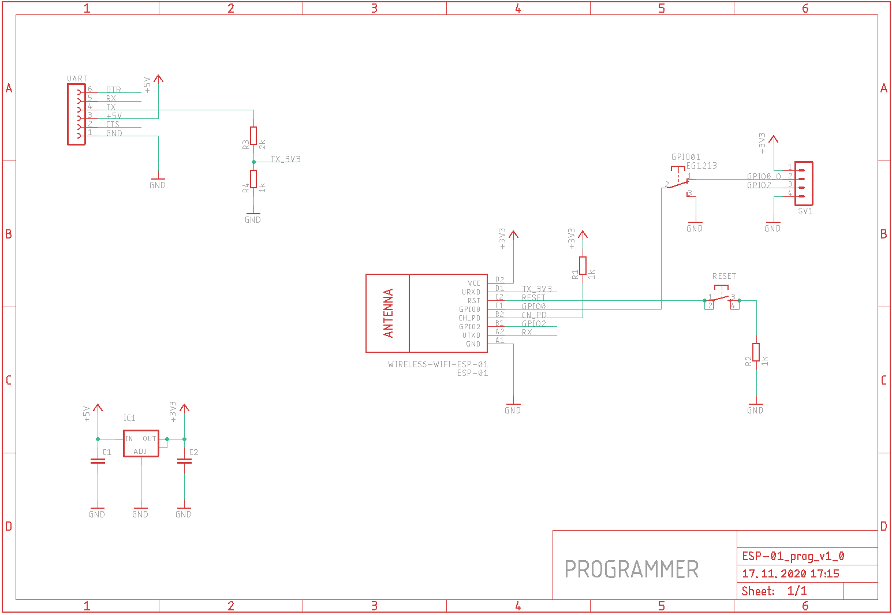
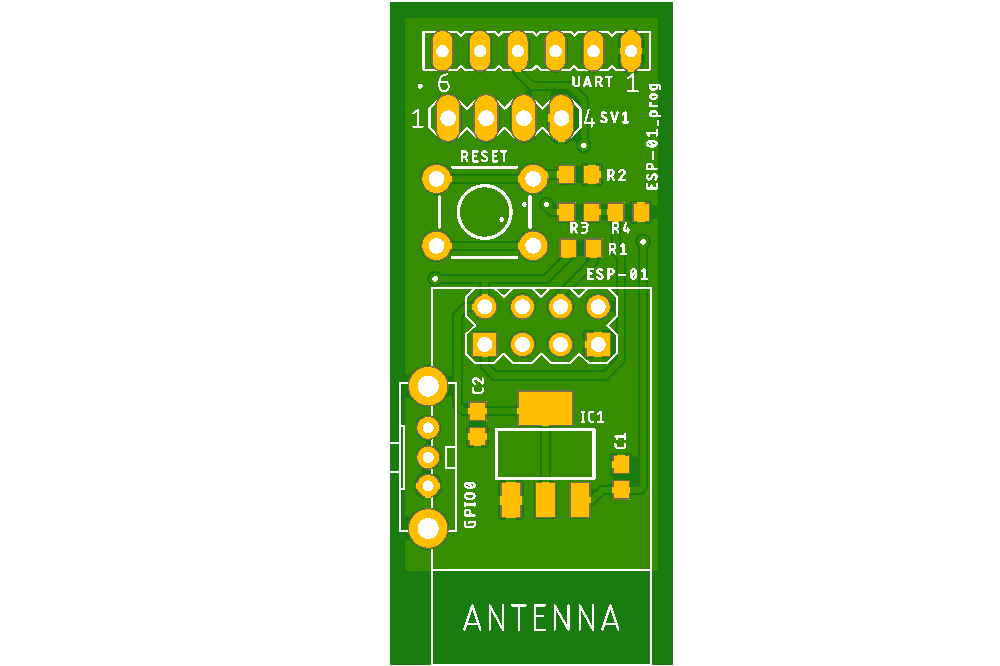
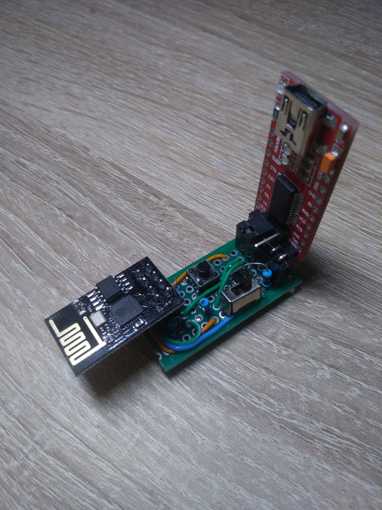

# ESP-01-programmer
Programmer for module ESP-01

If do you see in Arduino IDE console text "Connecting" then, switch GPIO0 pin to ground, ant push RESET button. 
After sucessfully upload source code to module ESP-01 please disconnect GPIO0 pin from ground, and push RESET button. 
After this step is surce code uploaded in MCU.

# ESP-01 module

# USB to UART converter
Do you need this USB to UART converter, but please logic level you must set to 5V

# Schematic

# Programmer board

# Prototype version

